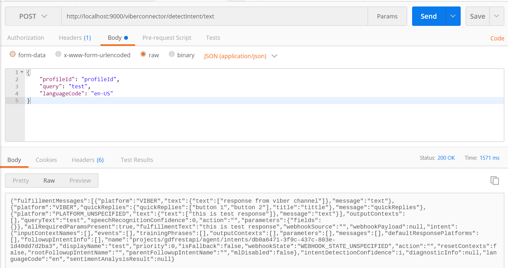

# EBL-DIA-Viber-Connector
Viber connector for Dialogflow ChatBot

# How To Test The Application
- Cone the repository to local directory on you PC
- Rename the config-example.js to config.js and replace the config parameters like log path, JSON key values
- To know more about Dialogflow REST API and generating the JSON key please refer [Dialogflow-REST-API-Middleware](https://github.com/satishgunjal/Dialogflow-REST-API-Middleware.git)
- Now run below command to install the dependencies in the local node_modules folder
  ```
  $ npm install
  ```
- Application controller conatins below files
  ```
  - dialogflow.js > contains the integration with Dialogflow REST API. Alos exports the functions which are used by viber.js and test-dialogflow.js
  - viber.js > contains the integration with Viber REST API. Consumes functions from dialogflow.js
  ```

- test folder contains below files
  ```
  - test-index.js > contains code to create express server
  - test-route.js > GET and POST routes configured and mapped with functions in test-dialogflow.js
  - test-dialogflow.js > contains functions which are mapped with GET and POST routes. 'exports.detectTextIntent' function calls function from dialogflow.js
  ```
- Now to test Dialogflow API separatly run below command
  ```
  $ node test\test-index.js   
  ```
 - Application should start without any error, to cross check browse this url : http://localhost:9000/
 - Testing using postman
 
   
  
    ```
    - Method: POST
    - URL: http://localhost:9000/viberconnector/detectIntent/text
    - Body: {
              "profileId": "profileId", 
              "query": "test",
              "languageCode": "en-US"
            }

     - You should receive the fullfilment response in return
    ```

